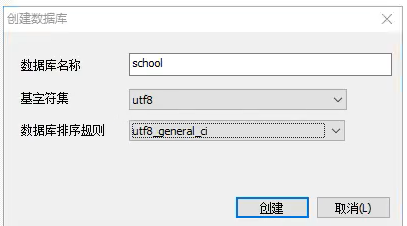
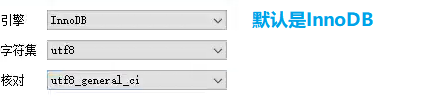

# 1、 MySQL #

JavaEE：企业级Java开发 主要是Web

前段（页面：展示数据库的数据）	

MySQL（存数据）

后台（连接数据库JDBC，连接前端，控制视图的跳转和给前端传递数据）

>只会写代码 + 学好数据库 = 基本混饭吃
>
>操作系统 + 数据结构 + 算法 = 不错的程序员
>
>离散数学 + 数组电路 + 体系结构 + 编译原理 + 实战经验 = 高级程序员


## 1.1、 为什么学数据库

1、 趋势、岗位需求

2、 现在的世界，大数据时代，得数据者得天下

3、 被迫需求：存数据

==4、 数据库是所有软件体系中最核心的存在==  比如说：DBA


## 1.2、 什么是数据库

数据库 DB（DataBase）

概念：数据仓库，是一个==软件==、安装在==操作系统上，但它是一个系统软件，==SQL可以==存储大量数据（500万条以下）== 

作用：存数据、管理数据


## 1.3、 数据库的分类

### 关系型数据库：行、列（SQL）

- MySQL、Oracle、Sql Server、DB2、SQLlite
- 通过表与表之间行和列之间的关系进行数据的存储


### 非关系型数据库：{key: value}	（NoSQL，Not Only SQL，不仅仅是SQL）

- Redis，MongDB
- 非关系型数据库，对象存储，通过对象的自身的属性进行存储


### ==DBMS：数据库管理系统==

- 数据库的管理软件，科学有效的管理数据、并能维护和获取数据；
- MySQL，本质是一个数据库管理系统


## 1.4、 MySQL简介

[MySQL](https://www.mysql.com/)是一个==关系型数据库管理系统==

前世：瑞典MySQLAB公司

今生：属于Oracle旗下产品

MySQL是最好的 ==RDBMS (Relational Database Management System，关系数据库管理系统)==应用软件之一。

开源的数据库软件软件

体积小、速度快、总体拥有成本低、招人成本低，程序员必备技能

适用于中小型网站或者大型网站，也可以建集群


## 1.5、 安装MySQL

### 自行百度


### 具体步骤：

#### 1、 解压

#### 2、 把这个包放在自己的想放的位置

#### 3、 配置环境变量

#### 4、 新建mysql配置文件（my.ini）

```ini
[mysqld]
port=3306	# MySQL服务运行时的端口号
character_set_server=utf8	# 客户端字符集
basedir=D:\mysql	# mysql程序所存放路径,常用于存放mysql启动、配置文件、日志等
datadir=D:\mysql\data	# MySQL数据存放文件(极其重要,会自动生成)
server-id=1
sql_mode=NO_AUTO_CREATE_USER,NO_ENGINE_SUBSTITUTION
lower_case_table_names=1
innodb_file_per_table = 1
log_timestamps=SYSTEM
explicit_defaults_for_timestamp=true
skip-grant-tables # 第一次进入数据库是跳过密码验证

log-error   = error.log
slow_query_log = 1
slow_query_log_file = slow.log
long_query_time = 5
log-bin = binlog
binlog_format = row
expire_logs_days = 15
log_bin_trust_function_creators = 1
secure-file-priv=D:\mysql\Uploads # 这个文件夹得自己建
# 修改默认时区为东八区
default-time-zone = '+08:00'
[client]   
default-character-set=utf8
```

#### 5、 管理员模式下的命令行，切换到mysql文件下的bin目录下，执行`mysqld -instal`（安装MySQL）

#### 6、 再输入 `mysqld --initialize-insecure --user=mysql ` 初始化数据文件夹

#### 7、 然后再次启动mysql，然后使用`mysql -uroot -p`进入mysql管理界面

#### 8、 启动mysql，进去修改密码（sql语句后面一定要加分号）

```sql
update mysql.user set authentication_string=password('密码自己设') where user='root' and 
Host='localhost';
```

（最后输入`flush privileges`；刷新权限）

#### 9、 删除my.ini文件的最后一句

#### 10、 重启mysql服务即可正常使用

#### 11、 测试

> 补充：sc delete mysql 删除服务


## 1.6、 安装SQLyog

### 1、 无脑安装

### 2、 注册

### 3、 打开数据库连接，进入界面

### 4、 新建一个数据库（其中utf8_general_ci可以保证中文不乱码）



==每一个sqlyog的执行操作，本质上对应着了一个sql语句，可以再软件的历史记录中查看==

### 5、 新建一张表




## 1.7、 连接数据库

命令行连接！

```sql
mysql -uroot -p --连接数据库

update mysql.user set authentication_string=password('密码自己设') where user='root' and 
Host='localhost'; --修改用户密码

flush privileges; --刷新权限

--------------------------------------------------------------------
--所有的sql必须以分号结尾

show databases; --显示全部的数据库
show tables; --显示当前数据库下所有的表

show create database 数据库名 --查看创建数据库的语句
show create table 表名 --查看创建表的语句

use 表名 -- 切换数据库

describe 表名 --显示表中字段的全部信息
等价于
desc 表名

create database 数据库名 --新建一个数据库

exit; --退出

--（sql自带）、# 单行注释
/*
	多行注释
*/
```


DDL	数据库定义语言

DML	数据库操作语言

DQL	数据库查询语言

DCL	数据库控制语言


# 2、 操作数据库

规律：操作数据库中–>操作数据库中的表-->操作数据库中的数据

## 2.1、操作数据库（了解）

### 1、 创建数据库

```sql
CREATE DATABASE [IF NOT EXISTS] 表名;
```

### 2、 删除数据库

```sql
DROP DATABASE [IF EXISTS] 表名;
```

### 3、 使用数据库

```sql
-- 如果表名或者字段名是特殊字符，就需要用反引号强调
USE 数据库名;
```

### 4、 查看数据库

```sql
SHOW DATABASE; --查看所有的数据库
```


### 学习思路：

- 对比SQLyog的可视化操作
- 固定的语法或关键字要熟记


## 2.2、 数据库的数据（列）类型

> 数值

- tinyint		    十分小的数据		1个字节
- smallint        较小的数据           2个字节
- mediumint   中等大小的数据   3个字节
- ==int                 标准的整数          4个字节     int    较常用==
- bigint             较大的数据           8个字节    long
- float               单精度浮点型       4个字节    float
- double           双精度浮点型       8个字节    double        （存在精度问题）
- decimal          字符串形式的浮点数        金融计算的时候，一般使用decimal


> 字符串，使用单引号

- char		  字符串固定大小	0~255
- ==varchar  可变字符串           0~65535    String     常用==
- tinytext   微型文本                2^8 - 1
- text          文本串                   2^16 - 1      保存大文本


> 时间日期

对应着Java中的java.util.Date类


- date        YYYY-MM-DD        日期格式
- time        HH:mm:ss           时间格式
- ==datetime YYYY-MM-DD HH:mm:ss        最常用的时间格式==
- timestamp        时间戳        1970.1.1到现在的毫秒数！
- year        年份表示


> null

- 没有值，未知
- ==不要使用NULL进行运算，结果为NULL==


## 2.3、 数据库的字段属性（重点）

==Unsigned：==

- 无符号的整数
- 不能声明为负数


==zerofill：==

- 0填充
- 不足的位数用0填充


==自增：==

- 自动在上一条记录上的基础上加1（默认）
- 通常用来设计唯一的主键，必须是主键类型
- 可以自定义设计主键自增的起始值和步长


==非空（NOT NULL）：==

- 假设设置为NOT NULL，如果不给它赋值，就会报错！
- 假设设置为NULL，则不填写值时，默认赋值为NULL


==默认（default）：==

- 设置默认的值
- 如果该列没有指定值，则默认赋值为默认的值


拓展：

```sql
/* 每一个表，都必须存在以下五个字段！用来做项目用，表示一个记录存在意义！
	id	--主键
	`version`	--乐观锁
	is_delete	--伪删除
	gmt_create	--创建时间
	gnt_update	--修改时间
*/
```


## 2.4、 创建数据库表

格式

```sql
CREATE TABLE [IF NOT EXISTS] `表名`(
	'字段名' 列类型 [属性] [索引] [注释],
   	'字段名' 列类型 [属性] [索引] [注释],
   	'字段名' 列类型 [属性] [索引] [注释],
    ........
   	'字段名' 列类型 [属性] [索引] [注释],
   	'字段名' 列类型 [属性] [索引] [注释]
)[ENGINE=INNODB DEFAULT CHARSET=utf8][注释];
```


## 2.5、 数据库表类型

```sql
-- 关于数据库引擎
/*
	INNODB	默认使用
	MyISAM	早些年使用的
*/
```

|            | MyISAM | INNODB                 |
| ---------- | ------ | ---------------------- |
|            | 不支持 | 支持                   |
| 数据行锁定 | 不支持 | 支持                   |
| 外键约束   | 不支持 | 支持                   |
| 全文索引   | 支持   | 不支持                 |
| 表空间大小 | 较小   | 较大，约为MyISAM的两倍 |


两种引擎各自的优点：

- MyISAM	节约空间，速度较快
- INNODB    安全性较高，支持事务处理，多表多用户操作


> 在物理空间上存在的位置

所有的数据库文件都存在data目录下，一个文件夹对应着一个数据库。本质还是文件的存储


拓展：MySQL引擎在物理文件上的区别

- INNODB在数据库中只有一个*.frm文件，以及上级目录下的ibdata1文件
- MyISAM对应的文件
    - *.frm		表结构的定义文件
    - *.MYD     数据文件（data）
    - *.MYI      索引文件（index）


> 设置数据库的字符集编码

```sql
CHARSET=utf8
```

不设置的话，就会使用mysql默认的字符集编码（不支持中文！）

mysql的默认编码是Latin1，不支持中文

在my.ini中配置默认的编码

```sql
character-set-setver=utf8
```


## 2.6、修改删除表

> 修改

```sql
-- 修改表名
ALTER TABLE 旧表名 RENAME AS 新表名

-- 增加标的字段
ALTER TABLE 表名 ADD 字段名 列属性

-- 修改标的字段（包括重命名和修改约束！）
ALTER TABLE 表名 MODIFY 字段名 列属性 -- 修改约束
ALTER TABLE 表名 CHANGE 旧字段名 新字段名 [列属性] -- 既可以重命名字段，又可以修改约束，但常用来重命名字段

-- 删除表的字段
ALTER TABLE 表名 DROP 字段名
```


> 删除

```sql
-- 删除表（如果存在表再删除）
DROP TABLE IF EXISTS 表名
```

==所有的创建和删除操作都尽量加上判断，以免出错==


注意点：

- 字段名尽量用着重号（``）包裹
- 注释： -- 或 /**/
- sql关键字大小不敏感
- 所有的符号全部用英文


# 3、 数据管理

## 3.1、 外键（了解即可）

> 方式一： 在创建表时，增加约束

```sql
KEY `FK_属性名` (作为外键的字段) CONSTRAINT `FK_作为外键的字段名` FOREIGN KEY (作为外键的字段) 
REFERENCES 参照哪个表(参照属性名);
```

==删除有引用关系的表，必须先将引用关系解除才能删掉==


> 方式二：创建表成功后，添加外键约束

```sql
ALTER TABLE 表 ADD CONSTRAINT 约束名 FOREIGN KEY(作为外键的字段) REFERENCE 参照哪个表(哪个字段)
```


==以上都是物理外键，即数据库级别的外键，我们不建议使用！（避免数据库过多造成困扰，这里了解即可）==


### ==`最佳实现`==

- 数据库就是单纯的表，只用来存储数据，只有行（数据）和列（字段）
- 需要外键时，可以用程序实现


## 3.2、 DML语言（全部记住，背下来）


## 3.3、 添加


## 3.4、 修改


## 3.5、 删除